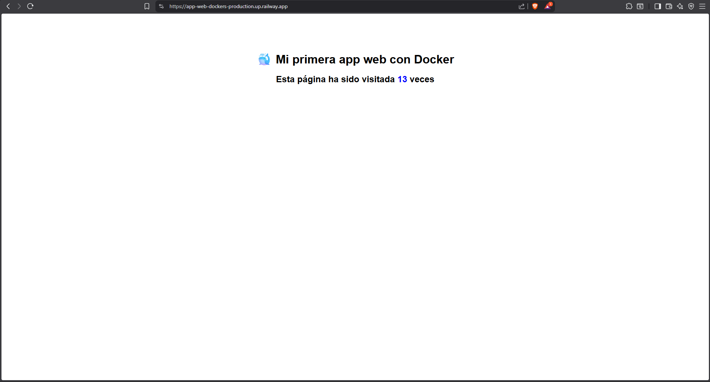

# 🐳 Flask Web App with Docker

[](https://app-web-dockers-production.up.railway.app)
[](https://www.python.org/)
[](https://www.docker.com/)

Web application with visit counter built with Flask, Redis and Nginx, fully containerized with Docker.

## 🌍 Live Demo

[https://app-web-dockers-production.up.railway.app](https://app-web-dockers-production.up.railway.app)

## Preview



## Architecture
```
User → Nginx (port 8080) → Flask (port 5000) → Redis
```

## Tech Stack

- **Flask** - Python web framework
- **Redis** - In-memory database for visit counter
- **Nginx** - Reverse proxy
- **Docker Compose** - Container orchestration

## Requirements

- Docker Desktop
- Docker Compose

## Installation
```bash
git clone https://github.com/Orlando-Alvarez/app-web-dockers.git
cd app-web-dockers
docker compose up --build
```

Then open your browser at `http://localhost:8080`

## Environment Variables

| Variable | Default | Description |
|---|---|---|
| REDIS_HOST | redis | Redis host |
| REDIS_PORT | 6379 | Redis port |