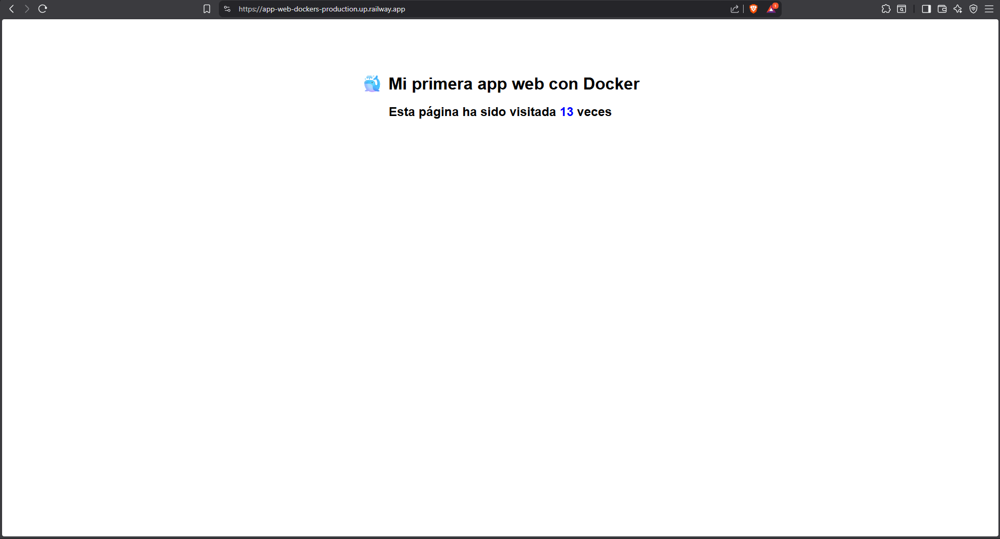

# 🐳 Flask Web App with Docker

[](https://app-web-dockers-production.up.railway.app)
[](https://www.python.org/)
[](https://www.docker.com/)

A containerized web application with a visit counter built using **Flask**, **Redis**, **Nginx**, and **Docker Compose**. The project demonstrates a simple multi-container architecture with a reverse proxy, an application container, and a Redis data store.


## 🌍 Live Demo

[https://app-web-dockers-production.up.railway.app](https://app-web-dockers-production.up.railway.app)

## Preview



## Architecture

```txt
User → Nginx (8080) → Flask App (5000) → Redis (6379)
```

The application runs as a multi-container setup:

1. The user opens the app through **Nginx** on port `8080`.
2. Nginx forwards the request to the **Flask** app running on port `5000`.
3. Flask increments a visit counter stored in **Redis**.
4. Redis stores the counter value while the service is running.

---

## Tech Stack

- **Flask** - Python web framework
- **Redis** - In-memory data store used for the visit counter
- **Nginx** - Reverse proxy that routes traffic to the Flask container
- **Docker** - Containerization
- **Docker Compose** - Multi-container orchestration
- **Railway** - Cloud deployment platform

---

## Requirements

- Docker Desktop
- Docker Compose
- Git

---

## Installation

Clone the repository:

```bash
git clone https://github.com/Orlando-Alvarez/app-web-dockers.git
cd app-web-dockers
```

Create a local environment file from the example file:

```bash
cp .env.example .env
```

Start the application:

```bash
docker compose up --build
```

Then open your browser at:

```txt
http://localhost:8080
```

---

## Local Development

Start the application locally:

```bash
docker compose up --build
```

Stop the containers:

```bash
docker compose down
```

Rebuild from scratch:

```bash
docker compose down -v
docker compose up --build
```

---

## Environment Variables

This project uses a `.env` file for local configuration. The real `.env` file should not be committed to GitHub. Instead, use `.env.example` as a template.

For local Docker Compose development, use:

```env
REDIS_URL=redis://redis:6379/0
```

| Variable    | Default                | Description                                        |
| ----------- | ---------------------- | -------------------------------------------------- |
| `REDIS_URL` | `redis://redis:6379/0` | Redis connection URL used by the Flask application |

---

## Railway Deployment

The project is deployed on Railway. In Railway, the Flask application service should include a `REDIS_URL` environment variable that points to the Railway Redis service.

Example:

```env
REDIS_URL=${{Redis.REDIS_URL}}
```

Railway builds and deploys the application automatically from the connected GitHub repository.

---

## Project Structure

```txt
app-web-dockers/
├── app.py
├── Dockerfile
├── docker-compose.yml
├── requirements.txt
├── .env.example
├── nginx/
│   └── nginx.conf
├── Screenshot.png
└── README.md
```

---

## What I Learned

- How to build a simple Flask application with Redis integration
- How to containerize a Python web app with Docker
- How to use Docker Compose to run multiple services together
- How Nginx works as a reverse proxy in front of an application container
- How to configure environment variables for local and cloud deployments
- How to deploy a containerized application to Railway

---

## Future Improvements

- Replace the Flask development server with Gunicorn for a more production-ready setup
- Add a `/health` endpoint for service health checks
- Add basic automated tests
- Improve the UI with a simple frontend template
- Add persistent Redis storage for production deployment

---

## Author

**Orlando Alvarez Figueroa**\
GitHub: [Orlando-Alvarez](https://github.com/Orlando-Alvarez)

